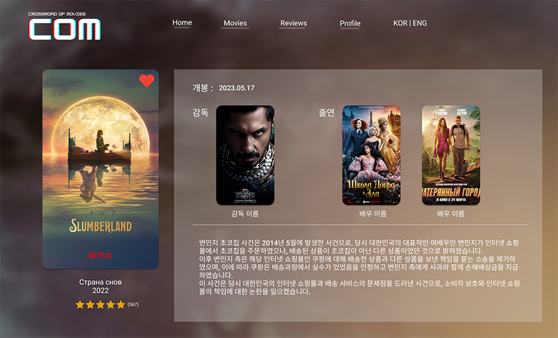
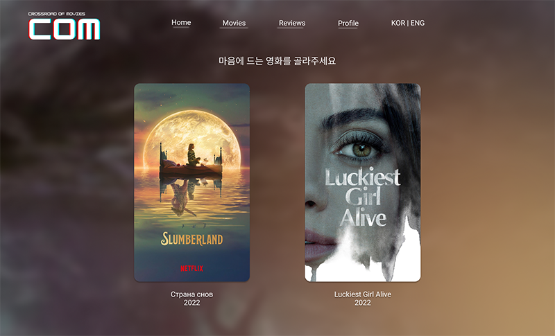

# **COM🎬**
###  'Crossroads Of Movies'의 약자로,
### 영화 선택의 갈림길에 서있는 "**MZ 세대**"를 위한 새로운 추천 시스템을 제공한다.


<blockquote>
수 없이 많이 쏟아지는 OTT컨텐츠 속에서 발견하는 보석!

"오늘 뭐 볼까?" 에 대한 답을 내려준다.

선택의 역설(The paradox of choice)에서 구해줄 단 하나의 선택지, **COM**
</blockquote>

<br><br>

# 가. 개발 기획

<br>

## 1) 개발 기간

📅 2023.05.17 ~ 2023.05.25 (9일)

<br>

## 2-1) 팀원 정보 및 업무 분담

👩‍💻**FrontEnd** 권소정 - 💃ESFP / 🦁사자자리(8월 21일) / 🩸AO(Rh+)

👨‍💻**BackEnd** 김준형 - 👨‍⚖️ENTJ / 🦀게자리(6월 28일) / 🩸O(Rh+)

<br>

## 2-2) 기술 스택

**FrontEnd**  Vue / Vuex / VueBootstrap

**BackEnd**  Python / Django

**DB**  Sqlite3

**UI tool**  Figma

<br>

## 2-3) 코드 스타일 가이드

**Python**  PEP8

**Java Script**  Airbnb

<br>

## 2-4) Git Commit Convention

📌**Commit Convention**
```
type: Subject - body
```

<br>

✏**Commit Type**


<br>

🐹**Subject Rule**

1. 제목은 최대 50글자
2. 마침표 및 특수기호 사용 X
3. 첫 글자 대문자, 명령문 사용
4. 개조식 구문으로 작성 (간결하게)

<br>

🐾**Body Rule**

1. 한 줄당 최대 72글자
2. 최대한 상세히 작성
3. 어떻게 보다는 `'무엇을'`, `'왜'` 변경했는지에 대해 작성

<br><br>

## 3-1) 목표 서비스
- 홈화면


<br>

- Movies 페이지


<br>

- 영화 디테일 페이지


    
<br>

- 날씨 기반 영화 추천


    
<br>

- 영화 월드컵 페이지


    
<br>

- 영화 월드컵 우승 영화 기반 추천 페이지


<br>

- 유저 프로필 페이지


<br>

- 유저 프로필 페이지 > 리뷰


<br><br>

## 3-2) 실제 구현 정도

준비중입니다..🙏

<br><br>

## 4-1) 데이터베이스 모델링(ERD)


<br>

## 4-2) API 설계

**final_pjt url**
|HTTP verb|URL 패턴|설명|
|---|---|---|
||`admin`|admin.site.urls|
||`movies/`|include('movies.urls')|
||`accounts/`|include('accounts.urls')|

**movies url**
|HTTP verb|URL 패턴|설명|
|---|---|---|
|GET|`movies/`|영화 페이지|
|GET|`movies/<int:movie_pk>/`|단일 영화 조회|
|POST|`movies/<int:movie_pk>/reviews/`|리뷰 작성|
|GET PUT DELETE|`movies/reviews/<int:review_pk>`|리뷰 상세 페이지|

**accounts url**
|HTTP verb|URL 패턴|설명|
|---|---|---|
|GET POST|`accounts/signup/`|회원가입 페이지|
|GET POST|`accounts/login/`|로그인 페이지|
|POST|`accounts/logout/`|로그아웃|
||`accounts/profile/<username>/`|유저 프로필 페이지|
|POST|`accounts/<int:user_pk>/follow/`|유저 팔로우|

<br><br>

## 5) 영화 추천 알고리즘

준비중입니다..🙏

<br><br>

## 6) 서비스 대표 기능

준비중입니다..🙏

<br><br>

## 7) 배포 서버

준비중입니다..🙏

<br><br>

# 나. 프로젝트 소개

준비중입니다..🙏

<br><br>

# 다. 일지 & 느낀점

📒 **5月 17日**

git 생성

- 기초 파일 생성 (django, vue)

목업 만들기 완료

ERD 작성 완료

README.md 초안 작성

- Commit 규칙 정하기
- 요구사항에 따라 틀 생성
- 코드 스타일 가이드 작성

**느낀점**

프로젝트 시작 전 계획 및 기획을 오늘까지 무사히 완료해서 만족스럽다.

막막했던 부분들을 잘게 쪼게니까 할만하다고 느껴졌다.

다른 팀들과 속도차이가 발생했는데, 우리팀만의 페이스로 진행하는게 중요하다고 생각한다.

여태껏 하지 않았던 커밋 규칙이나 ERD를 작성해 보아서 좀 더 체계적으로 프로젝트를 진행하는 기분이었다.

<br>

📒 **5月 18日**

Django 세팅

- models, serializers, urls

Vue 기본 작업

- App.vue
- Views 파일 생성
- router 설정

**느낀점**

이전 관통 프로젝트는 명세서를 기반으로 진행해서 쉬웠다면, 현재 프로젝트는 직접 명세서를 작성해서 진행하다보니 전보다 어려움

처음에 계획했던 내용은 진행하는 과정에서 많이 바꿔야한다는 사실을 알았다. > 처음에 계획을 확실히 세우자!

프로젝트를 진행하면서 serializers를 작성하려했는데, models로 빠지는 등 삼천포로 빠지는 일이 자주 있다..

<br>

📒 **5月 19日**

기존 파일의 문제를 인식하고, 해결하기 위해 새로 시작.

Vue - 기본파일 구성

Django - models, serializers, urls, views를 세팅

API를 Django에서 가져와서 불러오기 성공! (DB저장 완료)

**느낀점**

기본에 충실하자!

안배운게 나와도 검색으로 해결해야한다.

잘 갈아 엎었다.

DB에 대해서 더 공부하자.

주말과 야근은 필수

<br>

📒 **5月 21日**