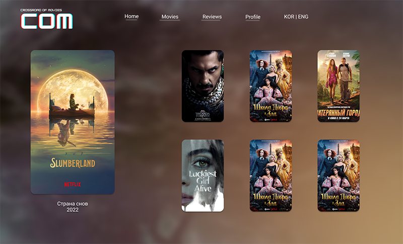

# **COM🎬**
###  'Crossroads Of Movies'의 약자로,
### 영화 선택의 갈림길에 서있는 "**MZ 세대**"를 위한 새로운 추천 시스템을 제공한다.


<blockquote>
수 없이 많이 쏟아지는 OTT컨텐츠 속에서 발견하는 보석!

"오늘 뭐 볼까?" 에 대한 답을 내려준다.

선택의 역설(The paradox of choice)에서 구해줄 단 하나의 선택지, **COM**
</blockquote>

<br><br>

# 가. 개발 기획

<br>

## 1) 개발 기간

📅 2023.05.17 ~ 2023.05.25 (9일)

<br>

## 2-1) 팀원 정보 및 업무 분담

👩‍💻**FrontEnd** 권소정 - 💃ESFP / 🦁사자자리(8월 21일) / 🩸AO(Rh+)

👨‍💻**BackEnd** 김준형 - 👨‍⚖️ENTJ / 🦀게자리(6월 28일) / 🩸O(Rh+)

<br>

## 2-2) 기술 스택

**FrontEnd** Vue / Vuex / VueBootstrap

**BackEnd** Python / Django

**DB** Sqlite3

**UI tool** Figma

<br>

## 2-3) Git Commit Convention

📌**Commit Convention**
```
type: Subject - body
```

<br>

✏**Commit Type**


<br>

🐹**Subject Rule**

1. 제목은 최대 50글자
2. 마침표 및 특수기호 사용 X
3. 첫 글자 대문자, 명령문 사용
4. 개조식 구문으로 작성 (간결하게)

<br>

🐾**Body Rule**

1. 한 줄당 최대 72글자
2. 최대한 상세히 작성
3. 어떻게 보다는 `'무엇을'`, `'왜'` 변경했는지에 대해 작성

<br><br>

## 3-1) 목표 서비스
- 홈화면


<br>

- Movies 페이지


<br>

- 영화 디테일 페이지


    
<br>

- 날씨 기반 영화 추천


    
<br>

- 영화 월드컵 페이지


    
<br>

- 영화 월드컵 우승 영화 기반 추천 페이지



<br>

- 유저 프로필 페이지


<br>

- 유저 프로필 페이지 > 리뷰


<br><br>

## 3-2) 실제 구현 정도

준비중입니다..🙏

<br><br>

## 4) 데이터베이스 모델링(ERD)


<br><br>

## 5) 영화 추천 알고리즘

준비중입니다..🙏

<br><br>

## 6) 서비스 대표 기능

준비중입니다..🙏

<br><br>

## 7) 배포 서버

준비중입니다..🙏

<br><br>

# 나. 프로젝트 소개

준비중입니다..🙏

<br><br>

# 다. 일지 & 느낀점

**5月 17日**


